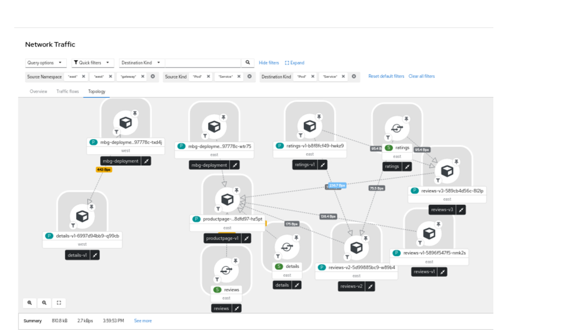

# Overview

This page summarizes a demonstration of network topology and connectivity between clusters using MBG (add link to MBG).

We have 2 clusters named **east** and **west**.
In the **east** cluster, we have an application called **productpage**, which uses components **reviews**, **ratings**, and **details**.
See [Bookinfo microservice application](https://istio.io/latest/docs/examples/bookinfo/).
The pod and service for **details** sit in the **west** cluster, while the other pods sit in the **east** cluster.

Mbg is used to make the **details** service (on the **west** cluster) available on the **east** cluster.
MBG creates a proxy **details** service in the **east** cluster.
To create this setup, run the command:
```
make all-in-one-mbg
```

The topology looks like the following.




There is network traffic between **mbg-deployment/east** and **mbg-deployment/west** that makes **details** service to appear as if it is on **east**.

The traffic between **mbg-deployment/east** and **mbg-deployment/west** is not seen in the picture because as far as the console is concerned, this traffic is outside of its purview - it is in the internet where the console does not see the traffic.


To show the virtual connectivity between the clusters, we re-assign the **mbg-deployment** nodes to their own namespace, so that the GUI places them together in the same box, giving the appearance of the continuity of the network flow.
To create this setup, run the command:
```
make all-in-one-mbg-gui
```

The topology now looks like the following.


The **details** pod actually sits in the **west** cluster, but its service is available on the **east** cluster.

Only entities (pods and services) that actually send traffic between each other and produce flow logs are shown in the graphs.
