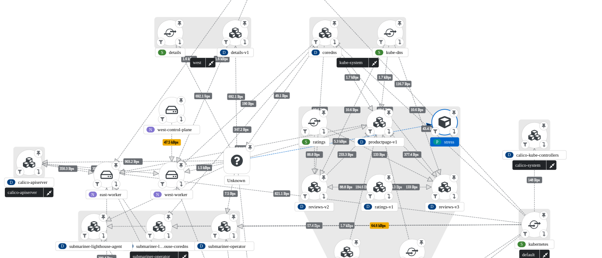
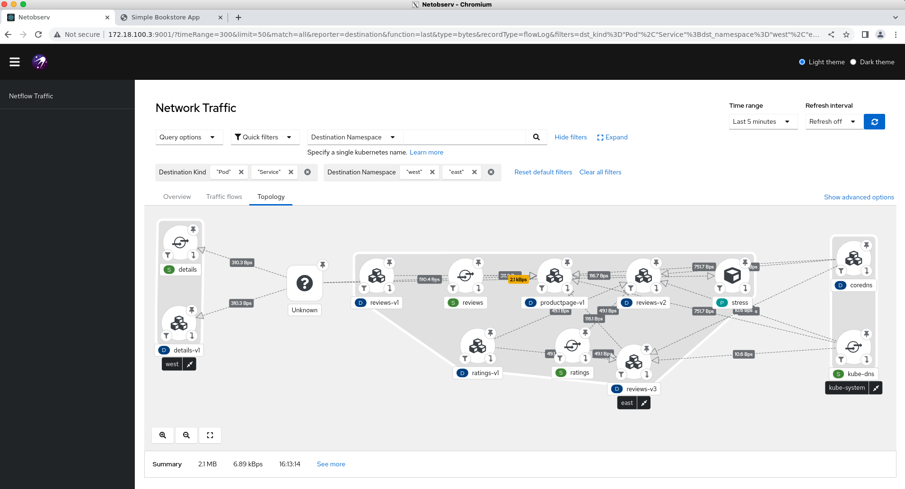
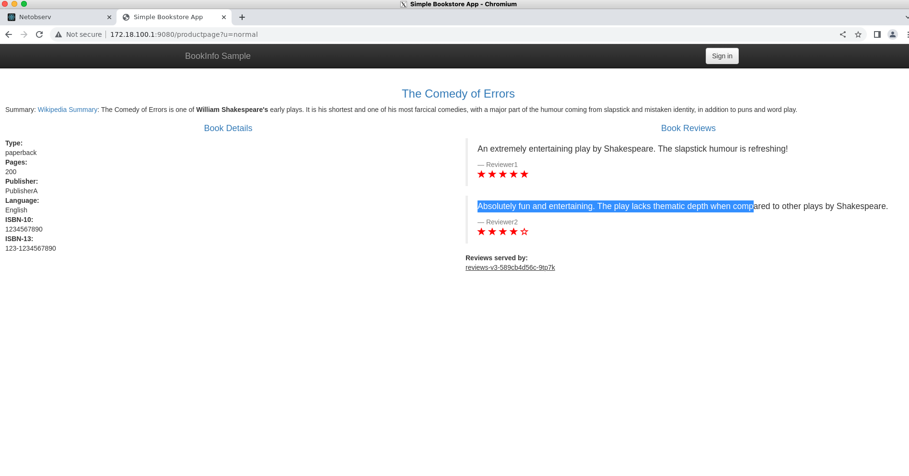

# Overview

This page summarizes a demonstration of network topology and connectivity between clusters using (Submariner)[https://submariner.io/].

We have 2 clusters named **east** and **west**.
In the **east** cluster, we have an application called **productpage**, which uses components **reviews**, **ratings**, and **details**.
The pod and service for **details** sit in the **west** cluster, while the other pods sit in the **east** cluster.

Submariner is used to make the **details** service (on the **west** cluster) available on the **east** cluster.
Submariner creates a proxy **details** service in the **east** cluster.
To create this setup, run the command:
```
make all-in-one-submariner
```

The topology looks like the following.



A different view showing `details` on one side and `product page` on other side is this.



Finally an image showing the webapp view after submariner connection.

